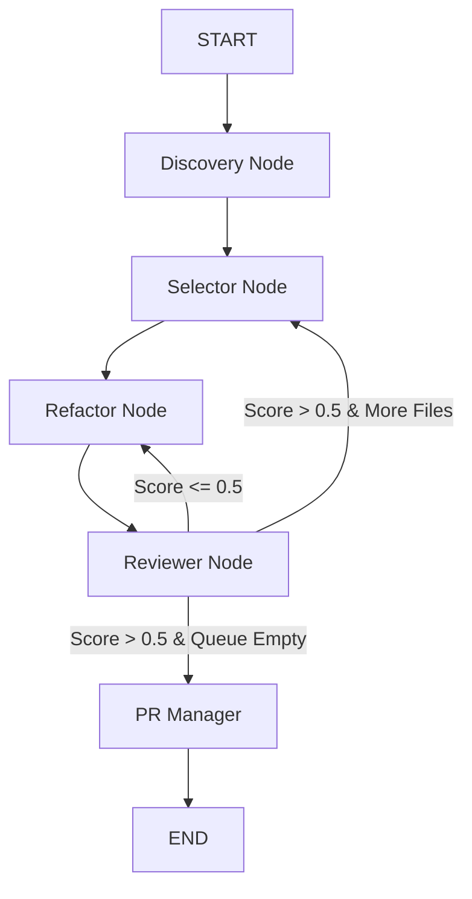
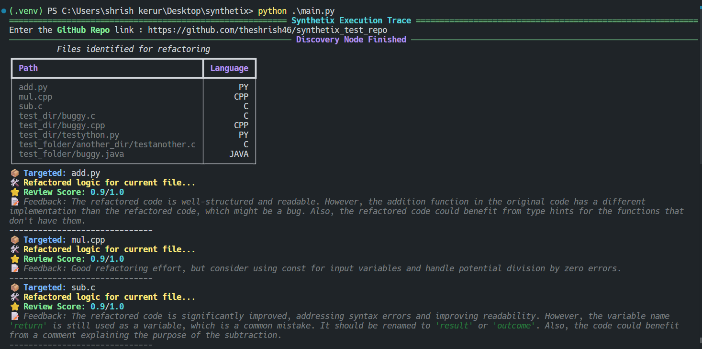
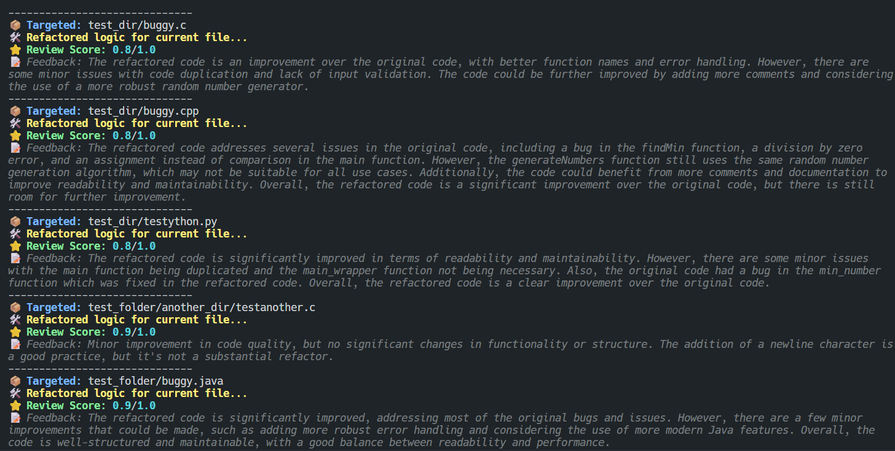
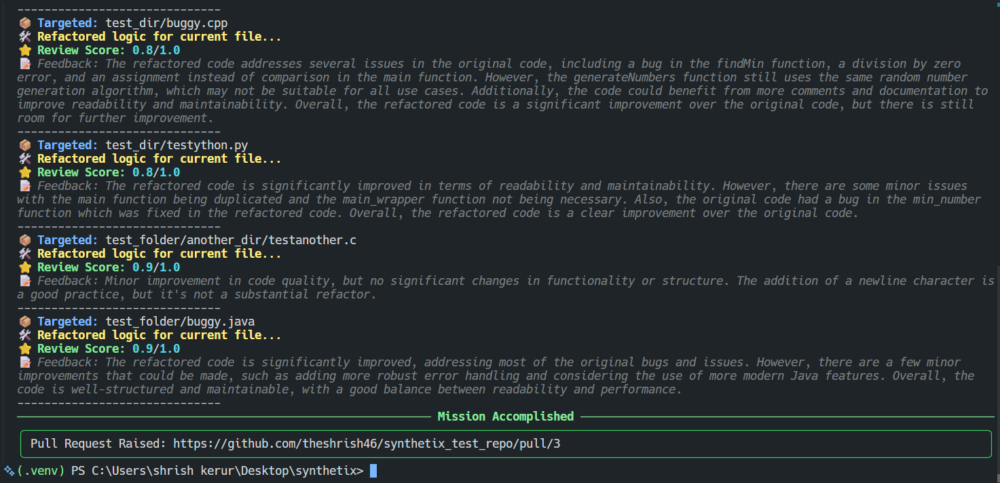

# Synthetix — Autonomous Multi-Language Git Agent

> **An autonomous state-machine that audits, refactors, and improves entire GitHub repositories — designed for the modern AI engineering workflow.**

---

## 🏗️ System Architecture & Engineering

Synthetix is a production-grade **Agentic AI System** built using **LangGraph**. Unlike standard "linear" AI scripts, Synthetix operates as a stateful Directed Acyclic Graph (DAG) with a **Self-Correction Loop**. 

### The "No-Clone" Strategy
Synthetix performs **Virtual Git Operations**. It interacts entirely via the **GitHub REST API**, performing atomic commits and optimistic locking via SHAs, ensuring zero local disk I/O and maximum memory efficiency.

### The Self-Healing Loop
Every refactor is audited by a separate **Reviewer Node**. If the code quality score falls below the 0.5 threshold, the agent enters a self-correction cycle, feeding the auditor's feedback back into the refactorer to fix its own mistakes before a single line of code is committed.

---

## 🧠 The Orchestration Graph



---

## 🚦 Execution Trace (TUI)

Synthetix features a high-density **Terminal UI** built with the `Rich` library, providing real-time visibility into the agent's thought process, file queue, and quality scores.


> 
> *Screenshot 1: The Discovery node mapping the repository structure.*

---

## ⚙️ Key Capabilities

### 🔍 Recursive Multi-Language Discovery
- Scrapes repositories recursively to handle nested directories (e.g., `src/utils/math.py`).
- Specifically targets actionable source files across **Python, C, C++, Java, and JavaScript**.

### ✨ Logic-First Refactoring
- Fixes off-by-one errors, undefined variables, and incorrect operators.
- Implements **Type Safety** and follows PEP8/Industry standards.
- Handles multiple languages in a single execution session.

### 📝 Atomic Commits & Optimistic Locking
- Retrieves file SHAs to ensure code hasn't changed on the remote during processing.
- Generates professional, context-aware commit messages and PR descriptions.

### 🔎 Automated Peer Review
- A secondary LLM instance audits the refactored code.
- Generates a **Review Score (0.0 - 1.0)** and specific technical feedback.

---

## 🛠️ Tech Stack

- **Orchestration:** [LangGraph](https://github.com/langchain-ai/langgraph) (Stateful Multi-Agent Workflows)
- **Models:** 
    - **Refactorer:** Llama 3.3 70B (via Groq) for high-reasoning code logic.
    - **Reviewer:** Llama 3.1 8B / Gemini 1.5 Flash for rapid, cost-effective auditing.
- **Infrastructure:** PyGithub (GitHub API), Pydantic (Structured Output Enforcement).
- **Interface:** [Rich](https://github.com/Textualize/rich) (Terminal UI).

---

## 🧬 State Management

Synthetix uses a centralized `AgentState` with a **Custom Reducer** (`operator.ior`). This allows for **Atomic State Updates**, where nodes return only the "delta" for the current file, preventing state bloat and ensuring the agent remains lightweight.

```python
class AgentState(TypedDict):
    repo_url: str
    files_to_process: List[str]
    current_file: Optional[str]
    repo_data: Annotated[Dict[str, Dict], operator.ior]  # Atomic Merge
    pr_url: Optional[str]
```

---

## Demo Results


>
> *Screenshot 2: The agent fixing a buggy `buggy.cpp` and receiving a 0.8/1.0 review score.*


>
>*Screenshot 3: PR Node raising PR to the repo with a new branch.*

### Example Refactor Output (add.py)
| Problem Found | AI Fix Applied |
| :--- | :--- |
| `subtract` used `+` | Corrected to `-` operator |
| Undefined variable `num12` | Resolved to `num2` |
| Missing Type Hints | Added `: int` and `-> int` signatures |
| Zero Division Risk | Added `ZeroDivisionError` handling |

---

## 🚦 Getting Started

### 1. Installation
```bash
git clone https://github.com/theshrish46/synthetix.git
cd synthetix
pip install -r requirements.txt
```

### 2. Environment Setup
Create a `.env` file:
```env
GROQ_API_KEY=your_key
GITHUB_TOKEN=your_token
```

### 3. Usage
```bash
python main.py
```

---

## 🚧 Future Roadmap
- **Execution Verification:** Integrating **E2B Sandboxes** to run unit tests on refactored code before PR.
- **Security Guardrails:** Automated security scanning using `Bandit` or `cppcheck` nodes.
- **MCP Server:** Transitioning the architecture to a **Model Context Protocol** server for universal IDE integration.

---

Please raise an issue for improvements, Thank You!!